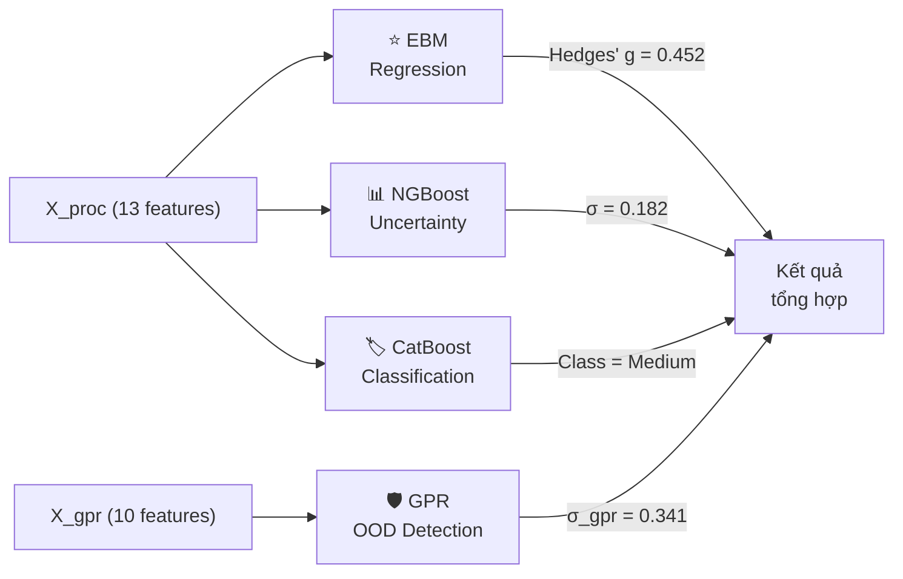

# 🧠 Giải Thích Dự Án TrainHyp AI

## 1. Tổng Quan Dự Án

**TrainHyp AI** là ứng dụng hỗ trợ cá nhân hóa kế hoạch tập luyện gym dựa trên Machine Learning. Nó trả lời câu hỏi: *"Với profile cá nhân của bạn, mỗi tuần nên tập bao nhiêu sets để cơ bắp phát triển tối ưu nhất?"*

### Kiến trúc tổng thể

```
┌─────────────────────────┐         ┌─────────────────────────────┐
│   Frontend (React/Vite) │◄──HTTP──►  Backend (Python/FastAPI)   │
│   - Nhập liệu (form)   │         │  - Xử lý input              │
│   - Hiển thị kết quả    │         │  - Chạy 4 models            │
│   - Biểu đồ dose-res   │         │  - Trả JSON kết quả         │
└─────────────────────────┘         └──────────┬──────────────────┘
                                               │
                                    ┌──────────▼──────────────────┐
                                    │  backend_models/ (28 files) │
                                    │  .pkl files = "bộ não" AI   │
                                    └─────────────────────────────┘
```

---

## 2. File Pickle (.pkl) Là Gì?

File `.pkl` (pickle) là **file nhị phân** chứa object Python đã được serialize (đóng gói). Trong dự án này, các file pkl chứa:
- **Models ML** đã train xong → load vào RAM, dùng ngay để predict mà không cần train lại
- **Preprocessors** (scaler, imputer) → biến đổi dữ liệu đầu vào giống cách đã biến đổi khi training
- **Metadata** → thông tin cấu hình, ngưỡng an toàn, tên features...

> [!IMPORTANT]
> Các file pkl được tạo ra từ 6 notebook Jupyter (NB01→NB06). Khi server khởi động, tất cả pkl được load 1 lần vào RAM thông qua `joblib.load()`.

---

## 3. Danh Sách Tất Cả File Pickle & Vai Trò

### 3.1 — 4 Models Chính (bộ não AI)

| File | Kích thước | Model | Vai trò | Tạo bởi |
|---|---|---|---|---|
| `ebm_model.pkl` | 224 KB | Explainable Boosting Machine | **Hồi quy** — dự đoán giá trị Hedges' g (mức độ tăng cơ) | NB01 |
| `ngb_model.pkl` | 1.4 MB | NGBoost | **Hồi quy xác suất** — đo **độ không chắc chắn** (σ) của dự đoán | NB02 |
| `catboost_clf.pkl` | 40 KB | CatBoost Classifier | **Phân loại** — xếp loại High/Medium/Low Responder | NB04 |
| `gpr_model.pkl` | 222 KB | Gaussian Process Regressor | **Phát hiện OOD** — cảnh báo input bất thường xa khỏi data huấn luyện | NB04 |

### 3.2 — 3 Preprocessors (tiền xử lý dữ liệu)

| File | Vai trò | Chi tiết |
|---|---|---|
| `scaler.pkl` | **StandardScaler** — chuẩn hóa 10 features liên tục | Biến đổi mỗi feature về mean=0, std=1 (giống cách đã scale khi train) |
| `imputer_cont.pkl` | **SimpleImputer** cho features liên tục | Điền missing value bằng median |
| `imputer_bin.pkl` | **SimpleImputer** cho 3 features nhị phân | Điền missing value cho `train_status_enc`, `upper_body`, `has_nutrition_control` |

### 3.3 — Metadata và thông tin phụ trợ

| File | Vai trò |
|---|---|
| `meta.pkl` | **File quan trọng nhất** — chứa TẤT CẢ metadata cần thiết cho deployment (xem chi tiết bên dưới) |
| `label_encoder.pkl` | Ánh xạ class index ↔ tên class (0→Low, 1→Medium, 2→High) |
| `clf_info.pkl` | Thống kê training của CatBoost (accuracy, confusion matrix...) |
| `ngb_info.pkl` | Thống kê training của NGBoost |

### 3.4 — File Không Dùng Trong Backend (chỉ dùng trong notebook)

| File | Ghi chú |
|---|---|
| `gam_model.pkl` | Model GAM thay thế — đã train nhưng không dùng trong production |
| `linear_model.pkl` | Linear regression baseline — benchmark only |
| `sem_results.pkl` | Structural Equation Modeling — phân tích quan hệ nhân quả |
| `tabnet_model.zip` | TabNet deep learning — thử nghiệm, không dùng trong ensemble |
| `tabnet_info.pkl` | Metadata của TabNet |
| `curve_info.pkl` | Thông tin dose-response curve từ notebook |

> [!NOTE]
> Backend chỉ load **8 file pkl**: `meta`, `scaler`, `imputer_cont`, `imputer_bin`, `ebm_model`, `ngb_model`, `catboost_clf`, `gpr_model`. Các file còn lại là sản phẩm phụ của quá trình training/phân tích.

---

## 4. File `meta.pkl` — Bản Đồ Cấu Hình

`meta.pkl` là dictionary Python chứa mọi thông tin metadata. Cấu trúc:

```python
meta = {
    # Danh sách 13 feature names
    'feature_names': ['sets.week.all', 'sets.week.direct', ...],
    
    # Phân loại features
    'continuous_cols': [...],    # 10 features liên tục
    'categorical_cols': [...],  # 3 features nhị phân
    
    # Ánh xạ class
    'class_mapping': {0: 'Low', 1: 'Medium', 2: 'High'},
    
    # Giá trị trung vị từ data training (dùng điền missing)
    'train_medians': {'sets.week.all': 12.0, 'age': 23.0, ...},
    
    # Range min/max của mỗi feature trong training data
    'feature_ranges': {'sets.week.all': (2.0, 48.0), 'age': (18.0, 65.0), ...},
    
    # SHAP feature importance scores
    'feature_importance': {'sets.week.all': 0.42, 'train_status_enc': 0.28, ...},
    
    # Ngưỡng an toàn
    'uncertainty_threshold': 0.35,   # NGBoost σ > threshold → cảnh báo
    'gpr_ood_threshold': 1.0,        # GPR σ > threshold → input bất thường
    'sets_p90': 32,                   # Giới hạn P90 kinh nghiệm
    
    # Safety rules
    'safety_rules': {
        'min_sets_junk_volume': 4,    # < 4 sets/tuần = quá ít
        'max_sets_physiological': 45, # > 45 sets/tuần = quá nhiều
        'safe_range_buffer': 5,       # Vùng an toàn: optimal ± 5 sets
    },
}
```

---

## 5. Luồng Xử Lý Từ Input → Output

Khi người dùng nhấn "Run Prediction" trên giao diện, đây là **toàn bộ quy trình** diễn ra:

### Bước 1: Frontend gửi request

```
POST /api/v1/predict
Body: { "sets_week_all": 18, "age": 25, "sex_male": 1, "train_status_enc": 2, ... }
```

Frontend map field names từ camelCase sang dot.notation. Chỉ `sets_week_all` là bắt buộc — còn lại có thể thiếu.

### Bước 2: FastAPI nhận & validate

[main_fastapi.py](file:///f:/class_project/pttk/AI_ML/main_fastapi.py) sử dụng Pydantic `UserInput` schema để:
- Kiểm tra kiểu dữ liệu (float, int)
- Kiểm tra range (ge/le constraints)
- Map từ `user.sets_week_all` → `"sets.week.all"` (dot notation cho model)

### Bước 3: Điền Missing Values (`_fill_missing`)

```python
# ai_engine.py dòng 83-93
for col in self.meta['feature_names']:
    if col not in df_input.columns or pd.isna(df_input[col].iloc[0]):
        fallback = train_medians.get(col, 0)  # Dùng median, KHÔNG dùng 0
        df_input[col] = fallback
```

> [!WARNING]
> Điền bằng 0 sẽ **phá hỏng** prediction. Ví dụ: `age=0` khiến GPR kernel cho kết quả vô nghĩa. Dùng median từ training data đảm bảo giá trị hợp lý.

### Bước 4: Preprocessing (`_preprocess`)

```
Input (13 features)
    │
    ├── 10 features liên tục ──► imputer_cont ──► scaler ──► X_cont (chuẩn hóa)
    │
    └── 3 features nhị phân  ──► imputer_bin  ──► X_bin (giữ nguyên 0/1/2)
    │
    ├── X_proc = [X_cont | X_bin]  (13 cột) → cho EBM, NGBoost, CatBoost
    └── X_gpr  = X_cont only       (10 cột) → cho GPR
```

GPR chỉ dùng 10 features liên tục vì Gaussian Process không phù hợp với biến nhị phân/categorical.

### Bước 5-8: Bốn Models Chạy Song Song



---

## 6. Chi Tiết Vai Trò Từng Model

### ⭐ Model 1: EBM — "Dự đoán chính"

| Thuộc tính | Giá trị |
|---|---|
| **Loại** | Explainable Boosting Machine (GAM cải tiến) |
| **Input** | X_proc (13 features, đã chuẩn hóa) |
| **Output** | Hedges' g — mức độ tăng cơ (số thực, thường 0–2) |
| **Thư viện** | `interpret` |
| **Cách dùng** | `self.ebm_model.predict(X_proc)[0]` |

**Vai trò chính:**
- Trả về **giá trị dự đoán trung tâm** — "với profile này, mức tăng cơ dự kiến là bao nhiêu?"
- Chạy **dose-response sweep**: quét từ 1→50 sets/tuần, giữ nguyên 12 features còn lại → vẽ ra đường cong "nên tập bao nhiêu?"
- Tìm **optimal_sets** = argmax trên đường cong (nhưng bị cap ở P90)

```python
# Dose-response sweep (ai_engine.py dòng 174-200)
sets_range = np.arange(1, 51)           # 1 → 50 sets
df_sim['sets.week.all'] = sets_range    # Thay đổi chỉ số sets
raw_preds = self.ebm_model.predict(X_sim_proc)  # EBM predict cho cả 50 trường hợp
curve_smooth = pd.Series(raw_preds).rolling(3, center=True).mean()  # Làm mượt
optimal_sets = int(sets_range[np.nanargmax(preds_safe)])  # Tìm đỉnh
```

---

### 📊 Model 2: NGBoost — "Đo độ tin cậy"

| Thuộc tính | Giá trị |
|---|---|
| **Loại** | Natural Gradient Boosting (Probabilistic Regression) |
| **Input** | X_proc (13 features) |
| **Output** | Phân phối Normal(μ, σ) — cả giá trị dự đoán VÀ độ lệch chuẩn |
| **Thư viện** | `ngboost` |
| **Cách dùng** | `self.ngb_model.pred_dist(X_proc)` → `.scale[0]` lấy σ |

**Vai trò chính:**
- Trả về **σ (sigma)** — mức độ không chắc chắn của dự đoán
- Nếu σ bé → model "tự tin" → prediction đáng tin cậy
- Nếu σ lớn (> threshold trong meta.pkl) → cảnh báo "Uncertainty cao"
- Tính **95% CI** = ±1.96 × σ (ví dụ: "±0.357")

```python
# ai_engine.py dòng 167-168
dist_now  = self.ngb_model.pred_dist(X_proc)  # Phân phối đầy đủ
sigma_ngb = float(dist_now.scale[0])            # Lấy σ
# → Nếu sigma_ngb > meta['uncertainty_threshold']: "⚠️ Uncertainty cao"
```

---

### 🏷️ Model 3: CatBoost — "Phân loại responder"

| Thuộc tính | Giá trị |
|---|---|
| **Loại** | Gradient Boosting Classifier (multiclass) |
| **Input** | X_proc (13 features) |
| **Output** | Class index: 0 (Low), 1 (Medium), 2 (High) |
| **Thư viện** | `catboost` |
| **Cách dùng** | `self.clf_model.predict(X_proc)[0]` → index → tra `class_mapping` |

**Vai trò chính:**
- Phân loại người dùng thành **3 nhóm đáp ứng** (dựa trên Hedges' g):
  - **Low Responder** (g < 0.2): Tập trung kỹ thuật, không nên tăng volume quá đà
  - **Medium Responder** (0.2 ≤ g < 0.8): Volume vừa phải, đều đặn
  - **High Responder** (g ≥ 0.8): Có thể tolerate volume cao
- Cung cấp **nhãn trực quan** cho user thay vì con số trừu tượng

```python
# ai_engine.py dòng 163-164
class_idx  = int(self.clf_model.predict(X_proc)[0])   # → 0, 1, hoặc 2
class_name = self.meta['class_mapping'][class_idx]     # → "Low", "Medium", "High"
```

---

### 🛡️ Model 4: GPR — "Cảnh giới an toàn"

| Thuộc tính | Giá trị |
|---|---|
| **Loại** | Gaussian Process Regressor |
| **Input** | X_gpr (CHỈ 10 features liên tục, chuẩn hóa) |
| **Output** | σ_gpr — posterior uncertainty (đo khoảng cách tới training data) |
| **Thư viện** | `scikit-learn` |
| **Cách dùng** | `self.gpr_model.predict(X_gpr, return_std=True)` → lấy std |

**Vai trò chính:**
- **Phát hiện Out-of-Distribution (OOD)** — biết khi nào input "lạ", xa khỏi data training
- GPR có đặc tính tự nhiên: **σ lớn khi xa data, σ nhỏ khi gần data**
- Bổ sung cho NGBoost: NGBoost đo "model không chắc chắn", GPR đo "input có bị lạ không"

```python
# ai_engine.py dòng 171-172
_, gpr_std = self.gpr_model.predict(X_gpr, return_std=True)
sigma_gpr  = float(gpr_std[0])
# → Nếu sigma_gpr > meta['gpr_ood_threshold']: "⚠️ Input xa training distribution"
```

> [!TIP]
> **Tại sao cần cả NGBoost lẫn GPR?** Vì chúng đo HAI loại uncertainty khác nhau:
> - NGBoost σ cao → "model không chắc chắn về kết quả" (epistemic + aleatoric)
> - GPR σ cao → "input này lạ, chưa từng thấy kiểu dữ liệu này" (input novelty)
> 
> Có thể xảy ra: NGBoost σ thấp (tự tin dự đoán) NHƯNG GPR σ cao (input lạ) → prediction "tự tin nhưng sai"

---

## 7. Cơ Chế An Toàn (Safety Engine)

Sau khi 4 model chạy xong, hệ thống kiểm tra **4 quy tắc an toàn**:

```
┌─────────────────────────────────────────────────────┐
│              4 Safety Rules                          │
├─────────────────────────────────────────────────────┤
│ Rule 1: Feature ngoài training range?                │
│   → "sets=55 ngoài [2, 48] — extrapolation"         │
│                                                      │
│ Rule 2: NGBoost σ vượt ngưỡng?                       │
│   → "Uncertainty cao (σ=0.51 > threshold 0.35)"     │
│                                                      │
│ Rule 3: GPR σ vượt ngưỡng OOD?                       │
│   → "Input xa training distribution (GPR σ=1.24)"    │
│                                                      │
│ Rule 4: Volume quá thấp/cao?                         │
│   → "3 sets/tuần quá thấp (<4) — junk volume"       │
│   → "46 sets/tuần rất cao (>45) — overtraining"     │
└─────────────────────────────────────────────────────┘
```

> [!CAUTION]
> Warnings chỉ mang tính **cảnh báo thông tin** — không block prediction. Kết quả vẫn được trả về, kèm danh sách warnings.

---

## 8. Kết Quả Trả Về (Response JSON)

Tất cả kết quả từ 4 model + safety engine được đóng gói thành JSON response:

```json
{
  "status": 200,
  "data": {
    "responder_class": "Medium",                    // ← CatBoost
    "responder_insight": "Cơ địa Medium Responder — cần volume vừa phải", 
    "current_status": {
      "sets_per_week": 18,
      "hedges_g": 0.452,                            // ← EBM
      "uncertainty": 0.182,                         // ← NGBoost σ
      "confidence_ci": "±0.357 (95% CI)"            // ← 1.96 × NGBoost σ
    },
    "recommendation": {
      "optimal_sets": 22,                           // ← EBM dose-response argmax
      "safe_range": [17, 27],                       // ← optimal ± buffer
      "optimal_g": 0.531,                           // ← EBM tại optimal sets
      "insight": "Undertraining — tăng lên 22 sets/tuần"  // ← Rule Engine
    },
    "confidence": {
      "level": "High",                              // ← NGBoost σ < threshold
      "sigma_ngb": 0.182,
      "sigma_gpr": 0.341                            // ← GPR
    },
    "warnings": [],                                 // ← Safety Engine
    "dose_response_curve": {
      "sets": [1, 2, ..., 50],                      // ← EBM sweep
      "hedges_g": [0.12, 0.15, ..., 0.48]
    }
  }
}
```

---

## 9. Tóm Tắt Bằng Một Hình

```
  Người dùng nhập: "18 sets/tuần, nam, 25 tuổi, intermediate"
                              │
                              ▼
                   ┌──────────────────┐
                   │   Điền missing   │ ← meta.pkl (train_medians)
                   │   Chuẩn hóa      │ ← scaler.pkl, imputer_*.pkl
                   └──────┬───────────┘
                          │
            ┌─────────────┼─────────────┬─────────────┐
            ▼             ▼             ▼             ▼
       ┌─────────┐  ┌──────────┐  ┌──────────┐  ┌──────────┐
       │   EBM   │  │ NGBoost  │  │ CatBoost │  │   GPR    │
       │ g=0.452 │  │ σ=0.182  │  │ "Medium" │  │ σ=0.341  │
       └────┬────┘  └────┬─────┘  └────┬─────┘  └────┬─────┘
            │             │             │             │
            └─────────────┼─────────────┼─────────────┘
                          ▼
                ┌──────────────────┐
                │  Safety Engine   │ ← 4 rules kiểm tra
                │  Rule Engine     │ ← Undertraining/Optimal/Overtraining
                └────────┬─────────┘
                         ▼
              Kết quả JSON → Frontend
              - "Tăng lên 22 sets/tuần"
              - "Medium Responder"
              - "Confidence: 95%"
              - Đường cong dose-response
```

---

## 10. Pipeline Huấn Luyện (Notebooks)

Các file pkl được tạo ra tuần tự từ 6 notebooks:

| Notebook | Mục đích | File pkl output |
|---|---|---|
| **NB01** EBM_GAM | Train EBM + GAM regression | `ebm_model.pkl`, `gam_model.pkl` |
| **NB02** NGBoost | Train NGBoost xác suất | `ngb_model.pkl`, `ngb_info.pkl` |
| **NB03** TabNet | Thử nghiệm deep learning (không dùng) | `tabnet_model.zip` |
| **NB04** CatBoost_GPR | Train CatBoost + GPR | `catboost_clf.pkl`, `gpr_model.pkl` |
| **NB05** SEM | Phân tích nhân quả (SEM) | `sem_results.pkl` |
| **NB06** Integration | Đóng gói metadata + so sánh | `meta.pkl`, `scaler.pkl`, `imputer_*.pkl`, `label_encoder.pkl` |

> [!IMPORTANT]
> **NB06 là notebook quan trọng nhất** — nó tạo ra `meta.pkl` chứa tất cả thông tin cấu hình cần thiết cho deployment. Nếu thay đổi bất kỳ model nào, phải chạy lại NB06 để cập nhật metadata.

---

*Tài liệu tạo cho môn STAT3013 — Statistical Learning (2026)*
